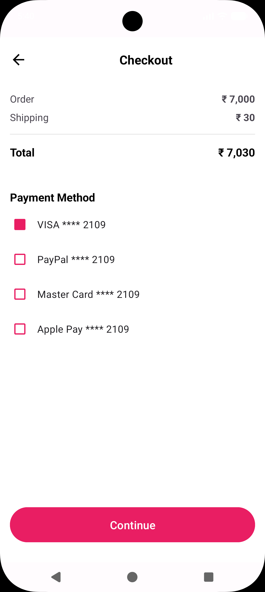
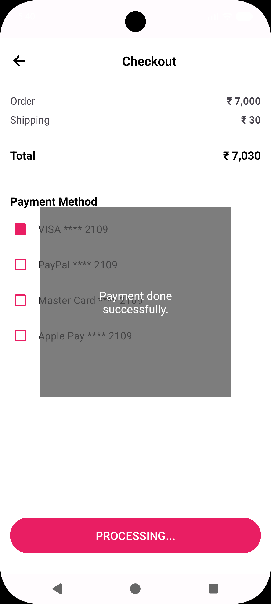

## 🛍️ E-Commerce Flow UI (Android Native)

A clean UI implementation for modern e-commerce apps, built using **Android's native XML layout system** and **Kotlin**.

### ✨ Features & Brands

**Action Table**
| Feature | Primary Action | Resulting View |
| :--- | :--- | :--- |
| **Onboarding** | "Get Started" | Navigates to Create Account |
| **Registration** | "Create Account" | Form Submission / Account Creation |
| **Checkout** | "Continue" | Processes Payment |
| **Password Recovery** | "Submit" | Sends Reset Link to Email |

**Brand Table**
| Category | Supported Brands |
| :--- | :--- |
| **Social Login** | Google, Apple, Facebook |
| **Payments** | VISA, PayPal, MasterCard, Apple Pay |

---

### 🖼️ Screenshots

All visual assets are stored in the `app1Screenshotes` directory.

| Welcome Screen | Create Account |
| :---: | :---: |
|  |  |

| Checkout Flow | Success Popup | Forgot Password |
| :---: | :---: | :---: |
|  |  |  |

---

### 🏗️ Key Implementation Details

#### **1. UI Layering (Splash & Popups)**
The project utilizes `FrameLayout` for screens where content must be layered:
* **Splash Screen:** An `ImageView` (`centerCrop`) is layered beneath a `TextView` and `Button`.
* **Checkout Success Modal:** The primary `LinearLayout` for the checkout form is layered beneath a transparent, full-screen `FrameLayout` (`#99000000` background) which contains the centered success message.

#### **2. Layout Composition**
The Checkout screen uses nested `LinearLayout` elements. Horizontal layouts align labels ("Order") with values ("₹ 7,000") using `android:layout_weight="1"`.

#### **3. Security & Logic**
* **Hashing:** Implements password hashing before data transmission to ensure user credential security.
* **Navigation:** Explicit `Intents` handle movement between Activities:

```kotlin
// Example: Navigation Logic
createAccountButton.setOnClickListener {
    val intent = Intent(this, CheckoutActivity::class.java)
    startActivity(intent)
}
